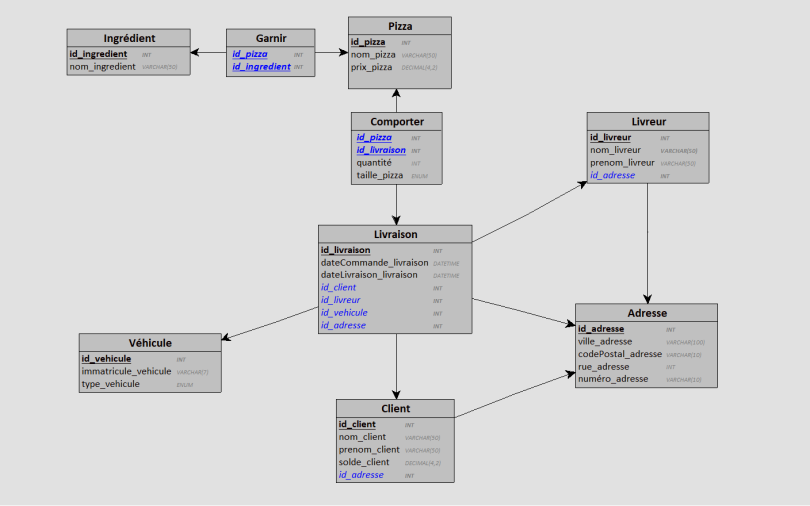
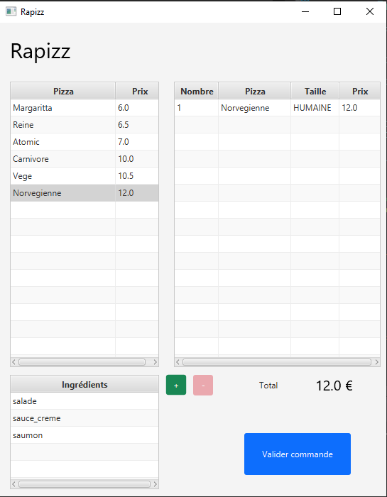

*PERRIN Baptiste*

*TAILLANDIER Mathieu*

*PELLAN Mathieu*


# Projet de base de données

Ce projet a été réalisé sur le thème d'une pizzeria "Rapizz" qui souhaite gérer ses commandes, ses livreurs, et autre via sa base de données.


**A noter:** Tout le code, le fichier looping, y compris les fichiers SQL sont retrouvables et consultables en ligne, sur un [dépôt GitHub](https://github.com/Armadindon/DatabasePizzaProject)

## Partie 1 - Définition de la base de données

Dans un premier temps, nous avons défini un schéma de base de données afin de répondre à la problématique:


- Nous avons commencé par réaliser ce MCD


- Ce qui nous a permis de générer ce MLD




Qui peut être aussi écrit:

```
Pizza = (id_pizza INT, nom_pizza VARCHAR(50), prix_pizza DECIMAL(4,2));
Ingrédient = (id_ingredient INT, nom_ingredient VARCHAR(50));
Adresse = (id_adresse INT, ville_adresse VARCHAR(100), codePostal_adresse VARCHAR(10), rue_adresse INT, numéro_adresse VARCHAR(10));
Véhicule = (id_vehicule INT, immatricule_vehicule VARCHAR(7), type_vehicule ENUM);
Client = (id_client INT, nom_client VARCHAR(50), prenom_client VARCHAR(50), solde_client DECIMAL(4,2), #id_adresse);
Livreur = (id_livreur INT, nom_livreur VARCHAR(50), prenom_livreur VARCHAR(50), #id_adresse);
Livraison = (id_livraison INT, dateCommande_livraison DATETIME, dateLivraison_livraison DATETIME, #id_client, #id_livreur, #id_vehicule, #id_adresse);
Garnir = (#id_pizza, #id_ingredient);
Comporter = (#id_pizza, #id_livraison, quantité INT, taille_pizza ENUM);
```


## Partie 2 - Implémentation du schéma

Afin d'implémenter cette base de données, nous avons réalisés trois scripts:

- Un script d'initialisation
- Un script d'insertion de données
- Et un script de suppression des tables


### Création du schéma de BDD

```sql
CREATE DATABASE IF NOT EXISTS RaPizzDB;
USE RaPizzDB;

CREATE TABLE IF NOT EXISTS Pizza(
   id_pizza INT AUTO_INCREMENT,
   nom_pizza VARCHAR(50),
   prix_pizza DECIMAL(4,2),
   PRIMARY KEY(id_pizza)
);

CREATE TABLE IF NOT EXISTS Ingredient(
   id_ingredient INT AUTO_INCREMENT,
   nom_ingredient VARCHAR(50),
   PRIMARY KEY(id_ingredient)
);

CREATE TABLE IF NOT EXISTS Adresse(
   id_adresse INT AUTO_INCREMENT,
   ville_adresse VARCHAR(100),
   codePostal_adresse VARCHAR(10),
   rue_adresse VARCHAR(100),
   numero_adresse VARCHAR(10),
   PRIMARY KEY(id_adresse)
);

CREATE TABLE IF NOT EXISTS Vehicule(
   id_vehicule INT AUTO_INCREMENT,
   immatricule_vehicule VARCHAR(9),
   type_vehicule ENUM ('VOITURE','MOTO'),
   PRIMARY KEY(id_vehicule)
);

CREATE TABLE IF NOT EXISTS Client(
   id_client INT AUTO_INCREMENT,
   nom_client VARCHAR(50),
   prenom_client VARCHAR(50),
   solde_client DECIMAL(5,2),
   id_adresse INT NOT NULL,
   PRIMARY KEY(id_client),
   FOREIGN KEY(id_adresse) REFERENCES Adresse(id_adresse) ON DELETE CASCADE
);

CREATE TABLE IF NOT EXISTS Livreur(
   id_livreur INT AUTO_INCREMENT,
   nom_livreur VARCHAR(50) NOT NULL,
   prenom_livreur VARCHAR(50),
   id_adresse INT NOT NULL,
   PRIMARY KEY(id_livreur),
   FOREIGN KEY(id_adresse) REFERENCES Adresse(id_adresse) ON DELETE CASCADE
);

CREATE TABLE IF NOT EXISTS Livraison(
   id_livraison INT AUTO_INCREMENT,
   dateCommande_livraison DATETIME,
   dateLivraison_livraison DATETIME,
   id_client INT NOT NULL,
   id_livreur INT NOT NULL,
   id_vehicule INT NOT NULL,
   id_adresse INT NOT NULL,
   PRIMARY KEY(id_livraison),
   FOREIGN KEY(id_client) REFERENCES Client(id_client) ON DELETE CASCADE,
   FOREIGN KEY(id_livreur) REFERENCES Livreur(id_livreur) ON DELETE CASCADE,
   FOREIGN KEY(id_vehicule) REFERENCES Vehicule(id_vehicule) ON DELETE CASCADE,
   FOREIGN KEY(id_adresse) REFERENCES Adresse(id_adresse) ON DELETE CASCADE
);

CREATE TABLE IF NOT EXISTS Garnir(
   id_pizza INT,
   id_ingredient INT,
   PRIMARY KEY(id_pizza, id_ingredient),
   FOREIGN KEY(id_pizza) REFERENCES Pizza(id_pizza) ON DELETE CASCADE,
   FOREIGN KEY(id_ingredient) REFERENCES Ingredient(id_ingredient) ON DELETE CASCADE
);

CREATE TABLE IF NOT EXISTS Comporter(
   id_pizza INT,
   id_livraison INT,
   quantite INT,
   taille_pizza ENUM ('NAINE','HUMAINE','OGRESSE'),
   PRIMARY KEY(id_pizza, id_livraison, taille_pizza) ON DELETE CASCADE,
   FOREIGN KEY(id_pizza) REFERENCES Pizza(id_pizza) ON DELETE CASCADE,
   FOREIGN KEY(id_livraison) REFERENCES Livraison(id_livraison) ON DELETE CASCADE
);
```

### Insertion des données par défaut

```sql
USE RaPizzDB;

INSERT INTO Adresse (ville_adresse,codePostal_adresse,rue_adresse,numero_adresse)
VALUES ('HYERES', '83400', 'GAMBETTA', '10bis'),
    ('CHAMPS-SUR-MARNES', '77420', 'NAPOLEON', '13'),
    ('MAZAMET', '81200', 'RUE DU PORT', '69'),
    ('HYERES', '83400', 'RUE DE LA CHAPELLE', '42');
    
INSERT INTO Client (nom_client,prenom_client,solde_client,id_adresse)
VALUES ('MARINO', 'ENZO', 639, 1),
    ('GRECO', 'NINO', 100, 2),
    ('CONTI', 'MILO', 25, 3),
    ('GIORDANO', 'DIEGO', 10, 4);
    
INSERT INTO Ingredient (`nom_ingredient`)
VALUES ('tomate'),
    ('salade'),
    ('champignon'),
    ('sauce_creme'),
    ('sauce_tomate'),
    ('saumon'),
    ('viande_hache'),
    ('oignon'),
    ('jambon'),
    ('olive'),
    ('Mozarella');
    
INSERT INTO Pizza (nom_pizza, prix_pizza)
VALUES ('Margaritta', 6.0),
    ('Reine', 6.5),
    ('Atomic', 7.0),
    ('Carnivore', 10.0),
    ('Vege', 10.5),
    ('Norvegienne', 12.0);
    
INSERT INTO Garnir (id_pizza, id_ingredient)
VALUES (1, 5),
    (1, 11),
    (2, 3),
    (2, 5),
    (2, 11),
    (3, 5),
    (3, 9),
    (3, 11),
    (4, 5),
    (4, 7),
    (4, 3),
    (4, 8),
    (4, 9),
    (5, 1),
    (5, 2),
    (5, 3),
    (5, 5),
    (5, 10),
    (5, 11),
    (6, 2),
    (6, 4),
    (6, 6);
    
INSERT INTO Vehicule (immatricule_vehicule, type_vehicule)
VALUES ('AG-963-SR', 'VOITURE'),
    ('BK-568-SR', 'MOTO'),
    ('CD-455-GK', 'MOTO');
    
INSERT INTO Livreur (nom_livreur, prenom_livreur, id_adresse)
VALUES ('ESCOBAR', 'PABLO', 1),
    ('ONYME', 'ANE', 2),
    ('LUIGI', 'COLOMBO', 3),
    ('MARIO', 'DE LUCA', 4);
    
INSERT INTO Livraison (
        dateCommande_livraison,
        dateLivraison_livraison,
        id_client,
        id_livreur,
        id_vehicule,
        id_adresse
    )
VALUES (
        '2020-06-14 5:00:00',
        '2020-06-14 18:00:00',
        1,
        1,
        1,
        1
    ),
    (
        '2020-06-14 17:00:00',
        '2020-06-14 18:00:00',
        1,
        2,
        1,
        1
    ),
    (
        '2020-06-14 17:00:00',
        '2020-06-14 18:00:00',
        1,
        3,
        1,
        1
    ),
    (
        '2020-07-15 17:00:00',
        '2020-07-15 18:00:00',
        1,
        4,
        2,
        1
    ),
    (
        '2020-07-15 17:00:00',
        '2020-07-15 18:00:00',
        1,
        1,
        2,
        1
    ),
    (
        '2020-07-15 17:00:00',
        '2020-07-15 18:00:00',
        1,
        2,
        2,
        1
    ),
    (
        '2020-07-20 17:00:00',
        '2020-07-20 18:00:00',
        2,
        3,
        3,
        2
    ),
    (
        '2020-07-21 17:00:00',
        '2020-07-21 18:00:00',
        3,
        4,
        3,
        3
    ),
    ('2020-07-23 17:00:00', NULL, 4, 1, 3, 4),
    ('2020-07-23 17:00:00', NULL, 1, 2, 1, 1);

INSERT INTO Comporter (id_pizza, id_livraison, taille_pizza,quantite)
VALUES (1, 1, 'NAINE',1),
    (1, 2, 'NAINE',2),
    (2, 3, 'HUMAINE',3),
    (4, 4, 'HUMAINE',4),
    (6, 5, 'OGRESSE',5),
    (1, 6, 'OGRESSE',6),
    (2, 7, 'OGRESSE',7),
    (3, 8, 'NAINE',8),
    (4, 9, 'HUMAINE',9),
    (5, 10, 'HUMAINE',10);
```

### Suppression des tables

```sql
USE RaPizzDB;

DROP TABLE IF EXISTS Garnir;
DROP TABLE IF EXISTS Comporter;
DROP TABLE IF EXISTS Ingredient;
DROP TABLE IF EXISTS Pizza;
DROP TABLE IF EXISTS Livraison;
DROP TABLE IF EXISTS Livreur;
DROP TABLE IF EXISTS Client;
DROP TABLE IF EXISTS Adresse;
DROP TABLE IF EXISTS Vehicule;
```

## Partie 3 - Interrogation de la base de données

Afin de faire cette partie, nous avons réalisé ces requêtes:

- Détection des véhicules n'ayant jamais servi :

```sql
SELECT `Vehicule`.`immatricule_vehicule` 
    FROM `Vehicule` 
    WHERE `Vehicule`.`id_vehicule` NOT IN (SELECT `Livraison`.`id_vehicule` FROM `Livraison`);
```

- Calcul du nombre de commandes par client :

```sql
SELECT `Client`.`nom_client`, count(`Livraison`.`id_livraison`) AS `NBCOMMANDE`
    FROM `Client`,`Livraison`
    WHERE `Client`.`id_client` = `Livraison`.`id_client`
    GROUP BY `Client`.`nom_client`;
```

- Calcul de la moyenne des commandes :

```sql
SELECT AVG(quantite) FROM Comporter;
```

- Extraction des clients ayant commandé plus que la moyenne :

```sql
SELECT nom_client FROM(
    SELECT Livraison.id_client, nom_client, SUM(quantite)/count(Livraison.id_livraison) AS "NBMoy"
        FROM Comporter
        NATURAL JOIN Livraison
        JOIN Client ON Livraison.id_client = Client.id_client
        GROUP BY id_client) AS TABDATA
WHERE TABDATA.NBMoy > (SELECT AVG(quantite) FROM Comporter);
```

- Extraction des données pour la carte :

```sql
SELECT 
    `Pizza`.`nom_pizza`,
    `Pizza`.`prix_pizza`*0.75 AS `PrixNaine`,
    `Pizza`.`prix_pizza`AS `PrixHumaine`,
    `Pizza`.`prix_pizza`*1.5 AS `PrixOgre`,
    GROUP_CONCAT(`Ingredient`.`nom_ingredient`SEPARATOR ', ' ) AS `Ingredient`
FROM `Pizza` 
    JOIN `Garnir` ON `Garnir`.`id_pizza` = `Pizza`.`id_pizza` 
    JOIN `Ingredient` ON `Garnir`.`id_ingredient` = `Ingredient`.`id_ingredient`
GROUP BY `Pizza`.`nom_pizza`;
```

- Extraction des clients ayant commandé plus que la moyenne :

  ```sql
  SELECT 
      `Livreur`.`nom_livreur`,
      `Vehicule`.`type_vehicule`,
      `Pizza`.`nom_pizza`,`Pizza`.`prix_pizza`,
      `Client`.`nom_client`,
      `Livraison`.`dateCommande_livraison`,
      `Livraison`.`dateLivraison_livraison`,
      TIMEDIFF(`Livraison`.`dateLivraison_livraison`,`Livraison`.`dateCommande_livraison` ) > "00:30:00" AS `RETARD`
  FROM `Livreur` 
      JOIN `Livraison` ON `Livraison`.`id_livreur` = `Livreur`.`id_livreur` 
      JOIN `Vehicule` ON `Livraison`.`id_vehicule` = `Vehicule`.`id_vehicule` 
      JOIN `Comporter` ON `Comporter`.`id_livraison` = `Livraison`.`id_livraison` 
      JOIN `Pizza` ON `Comporter`.`id_pizza` = `Pizza`.`id_pizza`
      JOIN `Client` ON `Livraison`.`id_client` = `Client`.`id_client`;
  ```

- Afin de gérer la Pizza offerte au bout de dix commande, nous avons écrit cette requètes SQL:

```sql
SELECT 
	Livraison.id_client, 
	nom_client,
	ABS(SUM(quantite) % 10 - 10) AS "Nombre de pizza avant la pizza Gratuite"
FROM Comporter
NATURAL JOIN Livraison
JOIN Client ON Livraison.id_client = Client.id_client
GROUP BY id_client;
```


## Partie 4 - Programmation

Afin de faire cette partie, nous avons réalisé une application Java en client lourd, basée sur la technologie JavaFX. Cette application possède plusieurs écrans, comme :

- Un écran de connexion à la base de données


- Un écran pour lister les commandes


- Un écran pour ajouter une commande



- Un écran pour afficher un ticket de caisse de la commande

